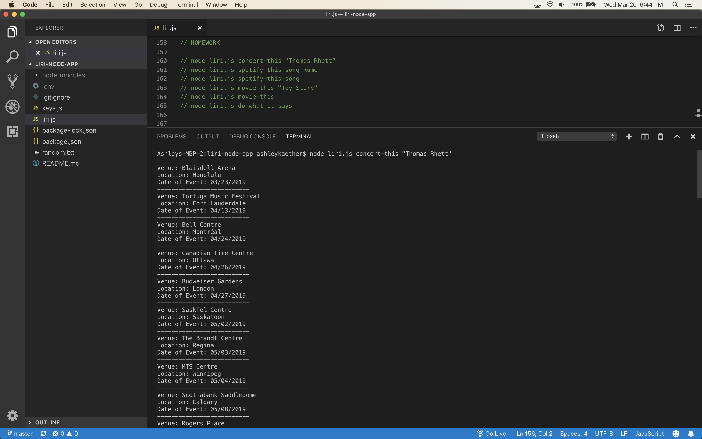

# liri-node-app
LIRI will be a command line node app that takes in parameters and gives you back data.

node liri.js concert-this "Thomas Rhett”

node liri.js spotify-this-song Rumor

node liri.js spotify-this-song

node liri.js movie-this "Toy Story"

node liri.js movie-this

node liri.js do-what-it-says

